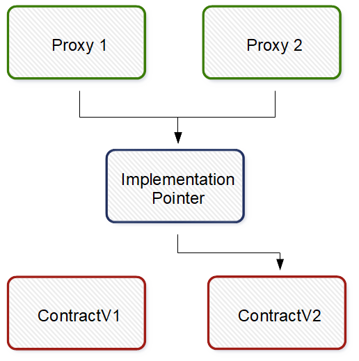

# Beacon proxy

Many proxies receive implementation address from beacon contract, which call, before main (delegated) call to implementation.

People use beacon proxy pattern, when project has many proxies and want to have opportunity to change implementation address in one transaction in all proxies.

1. Proxy ask beacon contract for implementation address
2. Proxy send delegate call to implementation contract

## Links:

* https://www.npmjs.com/package/@openzeppelin/hardhat-upgrades
* https://docs.openzeppelin.com/contracts/3.x/api/proxy#BeaconProxy
* https://blog.openzeppelin.com/the-state-of-smart-contract-upgrades/#beacons

